mv ~/Desktop/* ~/github/devops-projects/


# Container Orchestration with Kubernetes

## 1. Deploy MongoDB and Mongo Express into local K8s cluster

#### Technologies used:
Kubernetes, Docker, MongoDB, Mongo Express

### 1.1 Installed and setup Minikube

``` bash
$ minikube start --driver docker
$ minikube status
```

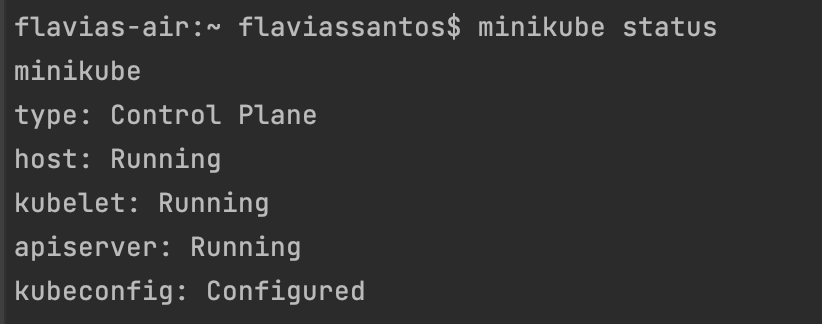  

❏ Installed Kubectl

``` bash
$ kubectl get node
```
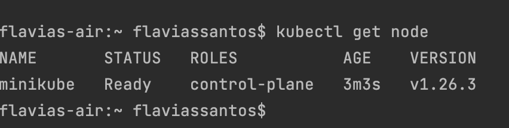

### 1.2 Kubernetes CLI - Main kubectl commands

❏ Created nginx Deployment

``` bash
$ kubectl create deployment nginx-depl --image=nginx
```
❏ Edited Deployment

``` bash
$ kubectl edit deployment nginx-depl
```

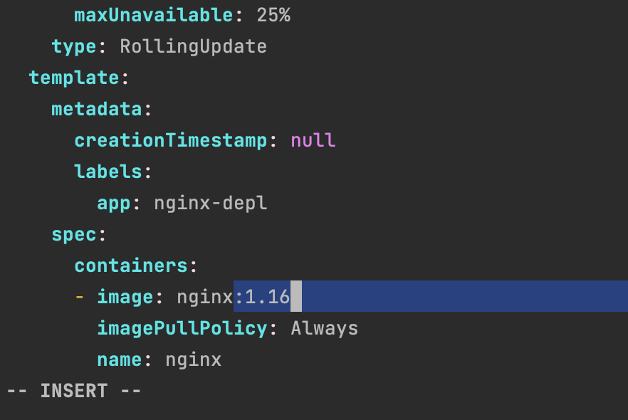 

❏ Created mongodb Deployment

``` bash
$ kubectl create deployment mongo-depl --image=mongo
```

❏ Inspected logs of a Pod

``` bash
$ kubectl logs mongo-depl-5ccf565747-q2mdd 
```

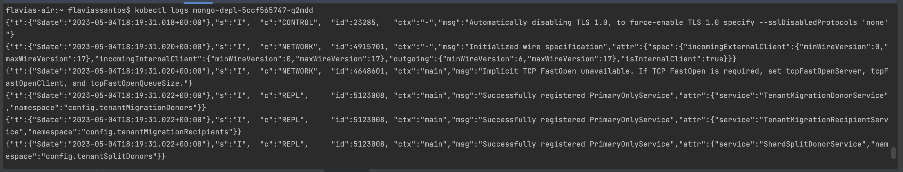  

❏ Got shell of a running container - kubectl exec

``` bash
$ kubectl exec -it mongo-depl-5ccf565747-q2mdd -- bin/bash 
```

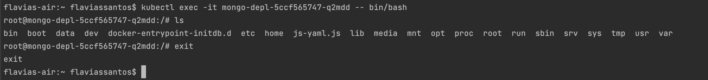  

❏ Deleted deployment

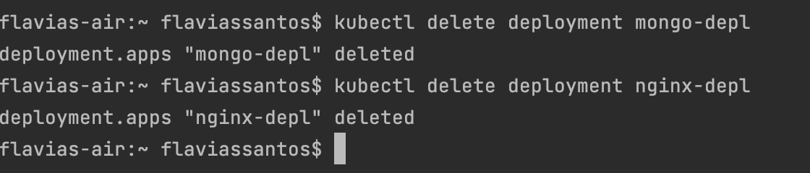  

❏ Applied configuration file

``` yaml
apiVersion: apps/v1
kind: Deployment
metadata:
  name: nginx-deployment
  labels:
    app: nginx
spec:
  replicas: 1
  selector:
    matchLabels:
      app: nginx
  template:
    metadata:
      labels:
        app: nginx
    spec:
      containers:
        - name: nginx
          image: nginx:1.16
          ports:
            - containerPort: 80
```

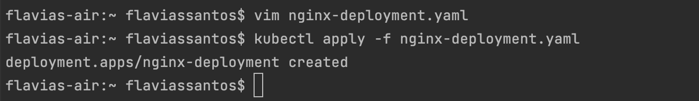  

### 1.2 Deploy MongoDB and MongoExpress with configuration and credentials extracted into ConfigMap and Secret

❏ Created MongoDB Deployment

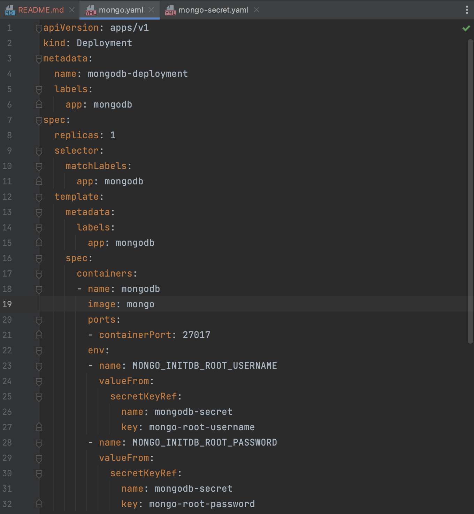  

❏ Created Secret for Mongo Credentials (base64 encoded)

```` bash
$ echo -n 'username' | base64
$ echo -n 'password' | base64
````

mongo-secret.yaml file:
```yaml
apiVersion: v1
kind: Secret
metadata:
    name: mongodb-secret
type: Opaque
data:
    mongo-root-username: dXNlcm5hbWU=
    mongo-root-password: cGFzc3dvcmQ=
```

Go into the folder you are creating the configuration files and run:
```bash
$ kubectl apply -f mongo-secret.yaml
$ kubectl get secret
$ kubectl apply -f mongo_.yaml
$ kubectl get pod --watch
```

❏ Created MongoDB Internal Service

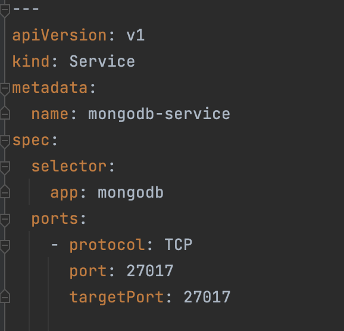 

``` bash
$ kubectl apply -f mongo.yaml
$ kubectl describe service mongodb-service
$ kubectl get pod -o wide
$ kubectl get all | grep mongodb
```

❏ Created MongoExpress Deployment and created ConfigMap for DB Server URL

mongo-configmap.yaml
``` yaml
apiVersion: v1
kind: ConfigMap
metadata:
  name: mongodb-configmap
data:
  database_url: mongodb-service
```

❏ Created Mongo Express External Service
``` bash
$ kubectl apply -f mongo-configmap.yaml
$ kubectl apply -f mongo-express.yaml
```
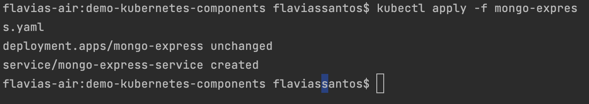  

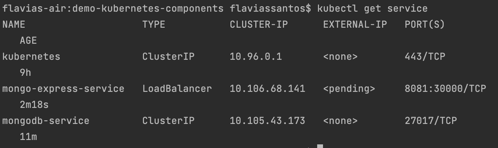

``` bash
$ minikube service mongo-express-service
```
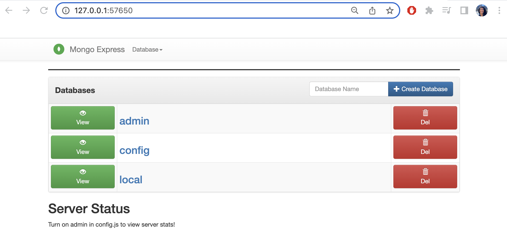  

## 2. Deploy Mosquitto message broker with ConfigMap and Secret Volume Types

#### Technologies used:
Kubernetes, Docker, Mosquitto

❏ Created Mosquitto Deployment without any volumes

❏ Created ConfigMap component to overwrite mosquitto.conf file

❏ Created Secret component to add passwords file

❏ Adjusted Mosquitto Deployment to include volumes

``` bash
$ kubectl apply -f config-file.yaml
$ kubectl apply -f secret-file.yaml
$ kubectl apply -f mosquitto.yaml
$ kubectl get pod
$ kubectl exec -it mosquitto-65f5cbcbc5-k5m5t -- /bin/sh
```

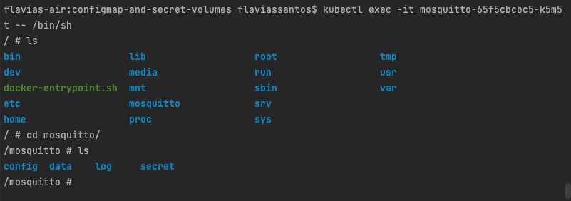  

## 3. Install a stateful service (MongoDB) on Kubernetes using Helm

#### Technologies used:
K8s, Helm, MongoDB, Mongo Express, Linode LKE, Linux

- Create a managed K8s cluster with Linode Kubernetes
Engine

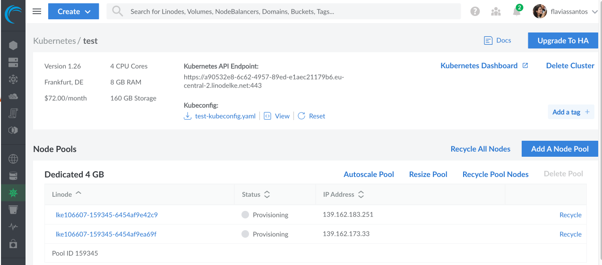 

``` bash
$ export KUBECONFIG=test-kubeconfig.yaml
$ kubectl get node
```

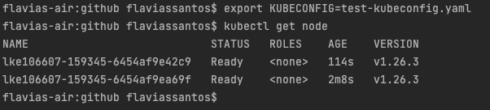 

- Deploy replicated MongoDB service in LKE cluster using a Helm chart

``` bash
$ helm repo add bitnami https://charts.bitnami.com/bitnami
$ helm search repo bitnami/mongodb

# overwrite some config
$ helm install mongodb --values test-mongodb-values.yaml bitnami/mongodb  
```
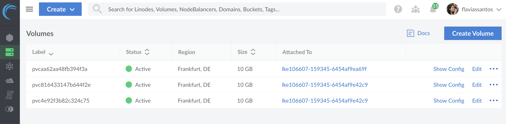 

- Configure data persistence for MongoDB with Linode’s cloud storage
- Deploy UI client Mongo Express for MongoDB

``` bash
 $ kubectl apply -f test-mongo-express.yaml
```
- Deploy and configure nginx ingress to access the UI
application from browser


  
  
