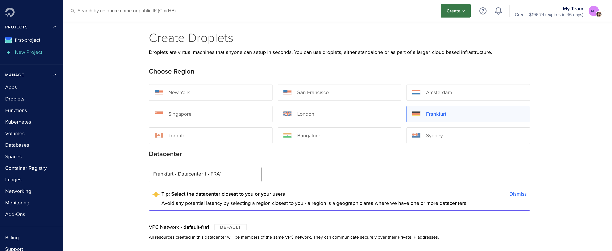
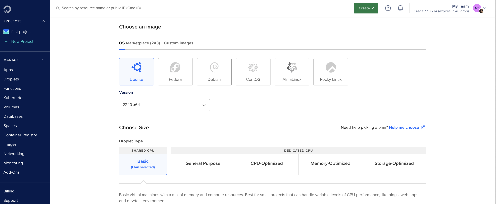
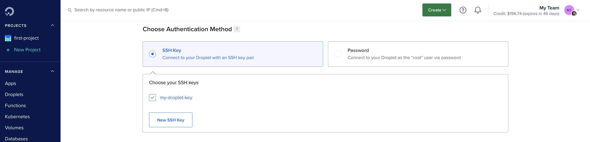
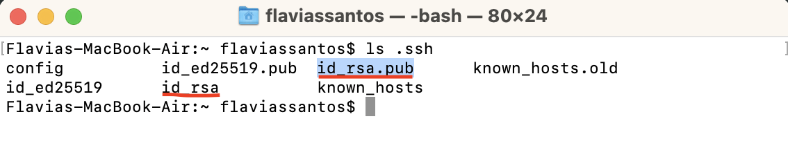
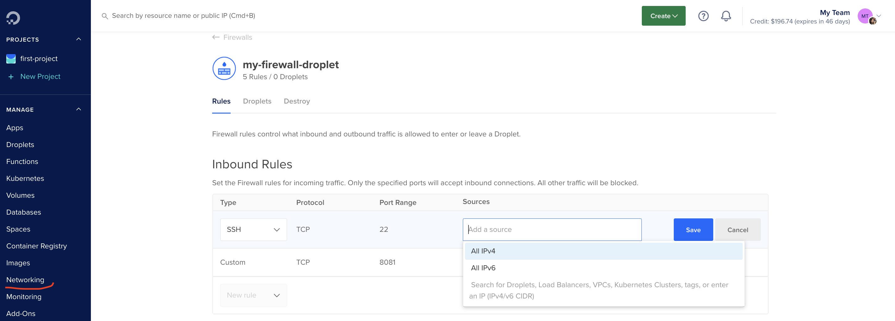
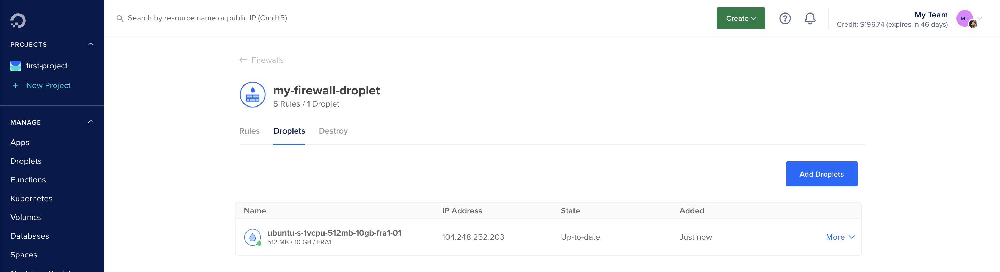
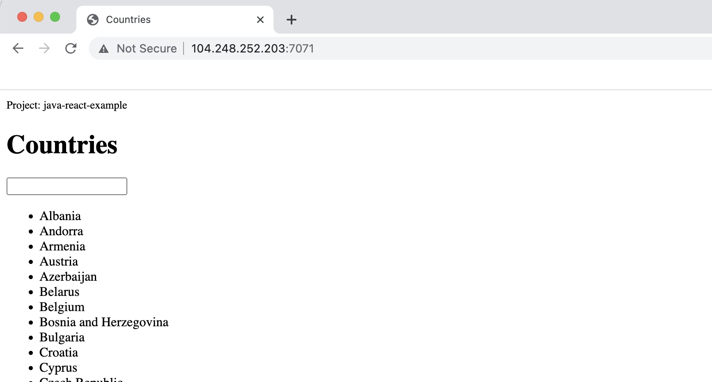
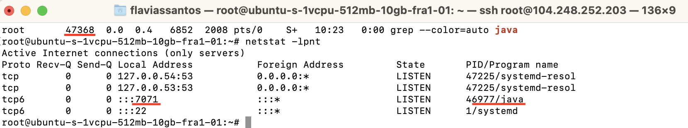
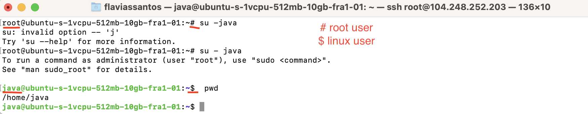

# Create server and deploy application on DigitalOcean

This project showcases the concept of Infrastructure as a Service (IaaS). I will show to deploy a Java application in a single cloud virtual server, using the platform DigitalOcean.

#### Technologies used:

DigitalOcean, Linux, Java, Gradle

## Setup and configure a server on DigitalOcean

It is very easy to create a droplet ( server on DigitalOcean). We are prompt with several options:

### Choose region

I selected the datacenter closest to me (Frankfurt).

### Choose an image and size

I selected Ubuntu as the Linux distributions, we can choose Ubuntu. And the basic plan offers us the necessary resources on the virtual machine.

### Choose authentication method

I selected SSH key to connect to the entire DigitalOcean platform.

SSH key pairs ( Private Key + Public Key) are basically encrypted values of random hashes created by the client machine to connect and configure the remote server.

* Private Key: should be securely stored in the client machine.
* Public Key: can be shared with the droplet to indicate that the client machine for that public key is safe to connect to.
To generate an SSH Key Pair on your computer using the cryptography algorithm RSA, you can simply run the following command in your terminal:

$ ssh-keygen -t rsa

The private key (id_rsa) and the public key (id_rsa.pub) will be available in the .ssh file by default. Then it can be copied from your terminal by running the command below and pasted in the droplet window.

$ cat ~/.ssh/id_rsa.pub

The rest of the configuration to create a droplet can be as it is.

### Create Firewall rules

Firewall configures the specific port where the server is accessible and this port is always open to an application. In the Networking tab, we can configure the Port 22 and our IP address as our firewall inbound rule. After that the communication is allowed and the SSH authentication will occur.

We need to assign that firewall rule to the droplet server we just created:

The server is accessible from your terminal by running the command (as a root user):

$ ssh root@[IP address of your droplet]

### Install java

Since the server is completely clean, we need to install Java (version 8) in order to run our application:

$ apt get update

$ apt install openjdk-8-jre-headless

## Deploy and run a Java Gradle application on Droplet

Now we can copy a jar file that we are going to build locally to the remote Ubuntu server and then run the app on that server. After that, the application can be accessed on the browser.

#### Build a jar file with Gradle and secure copy it into the remote server

$ cd [project folder]

$ ./gradlew build

$ scp [file locally] root@[destination IP]/[destination path]

$ java -jar [project name] &

Then we can see the port in which the application server is listening at.

### Access it from a browser

First we need to add a new inbound firewall rule opening that port from all sources:
Java-port 

To access the UI of the application from a browser, just type the "IP address of the droplet:app port", example "http://104.248.252.203:7071/".

We can see if the app is running on server and check which servers that have active internet connections with:

$ ps aux | grep java

$ netstat -lpnt

## Create and configure a new Linux user on the Droplet (Security best practice)

Generally, when administering a server we should not run applications as a root user. The best practice is to create a user for every application we run on that server and give it only the permission it needs to run that specific application.

### Create a linux application user

If we need to escalate privileges for that user, by giving permissions to some sudo commands, then we run the second line below. To switch to the user just created we run the third line:

$ adduser java

$ usermod -aG sudo java

$ su - java

### Add SSH public key for the application user

This command should be run in a new terminal in order to copy your SSH public key.

$ cat ~/.ssh/id_rsa.pub

Then you can go back to the terminal where you are logged in in the Ubuntu server as an application user and paste your SSH public key in an appropriate file:

$ mkdir .ssh

$ sudo vim .ssh/authorized_keys

To test it out, exit from the java user and from the root user. Then log in as the new user created:

$ exit

$ exit

$ ssh java@[droplet IP address]

You should then be able to login again.