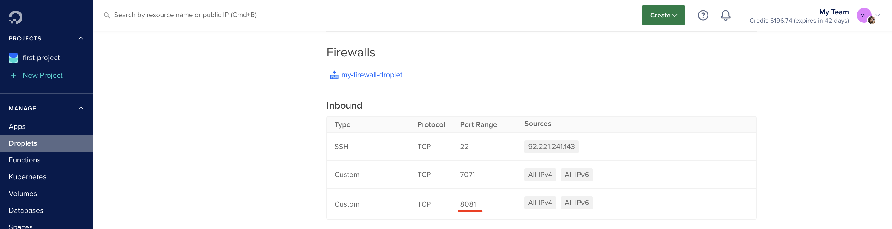
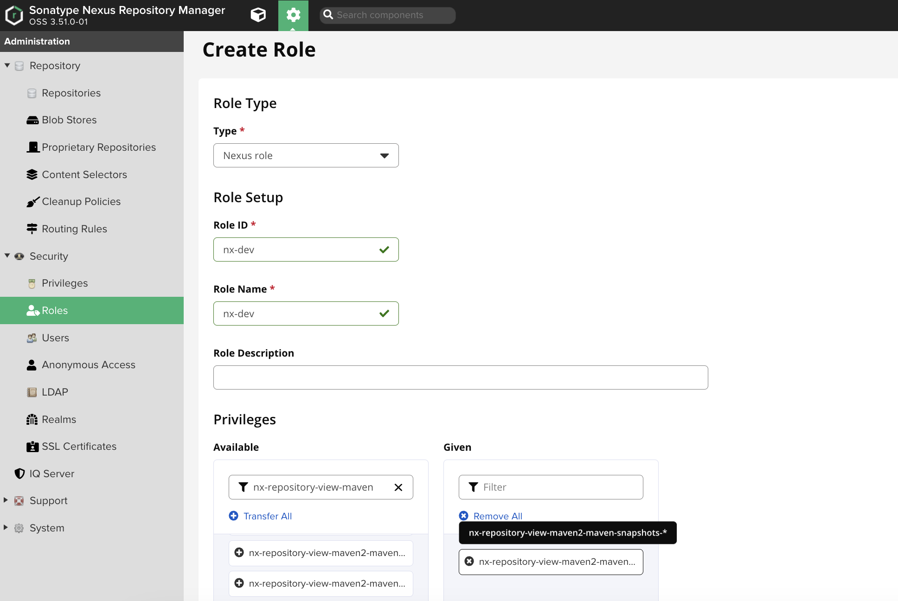
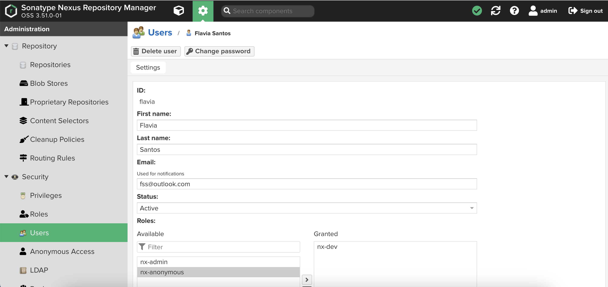
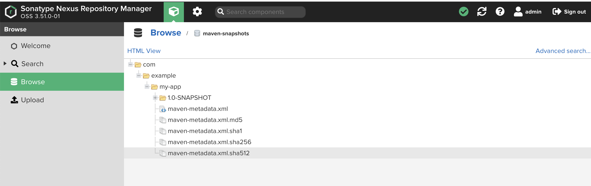
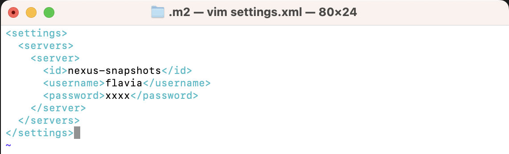
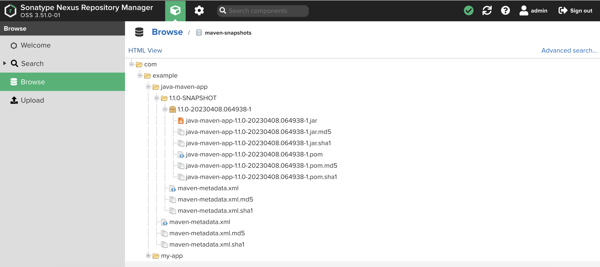
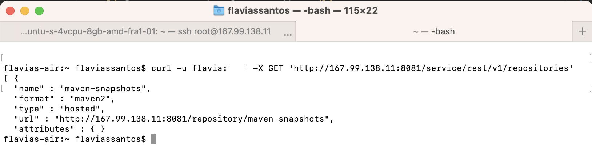
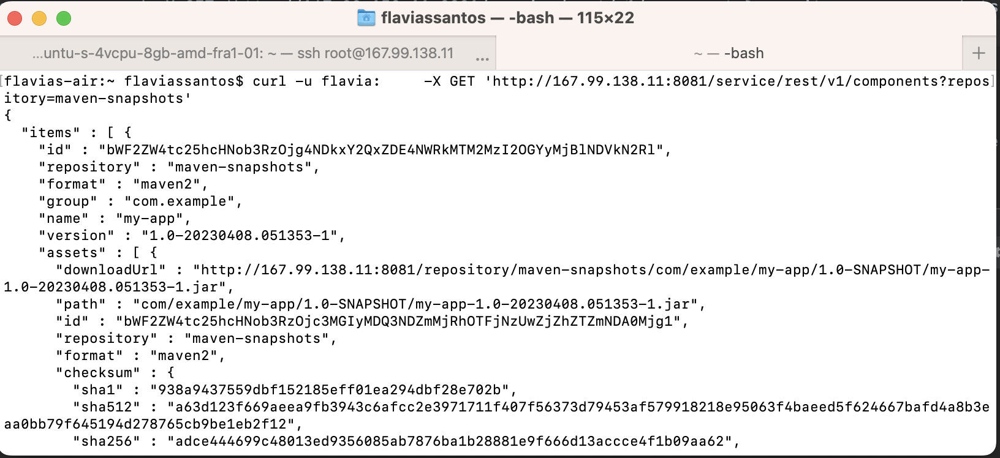

# Run Nexus on DigitalOcean and Publish Artifact to Nexus

Nexus is a popular open-source artifact repository manager that helps manage software artifacts, dependencies, and binaries by providing a centralized platform to store, manage, and distribute them across development teams, making it an essential tool for software developers, DevOps, and software organizations. Nexus is essential for companies that do not want to make their work available to the public.

In this project, we have used technologies such as Nexus, DigitalOcean, Linux, Java, Gradle, and Maven. The goal of the project is to install and configure Nexus from scratch on a cloud server and create a new user on Nexus with relevant permissions. Then, we will build a Java Gradle Project and a Java Maven Project and upload the built jar files to Nexus.

#### Technologies used:

Nexus, DigitalOcean, Linux, Java, Gradle, Maven

## Install and configure Nexus from scratch on a cloud server

To install and configure Nexus on a DigitalOcean Droplet, we followed the official Nexus installation guide. We created a new Droplet with Ubuntu, logged in to the Droplet via SSH, following the similar approach as the project "Create server and deploy application on DigitalOcean" , but the droplet had more memory resource. Then we installed Java 8, downloaded and install Nexus and created "nexus" user and group (best practice: run applications with own user). We ran the following commands:

$ apt update

$ apt install openjdk-8-jre-headless

$ apt install net-tools

$ cd /opt

$ wget https://download.sonatype.com/nexus/3/latest-unix.tar.gz

$ tar -zxvf latest-unix.tar.gz

## Create new User on Nexus with relevant permissions

After creating a nexus user, we need to change the permissions for it, so it can run the binaries in the Nexus directory and also make changes to the configurations on the Sonatype directory.

$ adduser nexus

$ chown -R nexus:nexus nexus-3.51.0-01/

$ chown -R nexus:nexus sonatype-work/

## Nexus Permission

Next, in the nexus.rc file, we added the following line run_as_user="nexus". Then we switched to nexus user to run the application.

$ vim nexus-3.51.0-01/bin/nexus.rc

run_as_user="nexus"

$ su - nexus

$ /opt/nexus-3.51.0-01/bin/nexus start

We can also check if nexus is running and in which port it is listening at with the commands bellow. Then we can add a inbound firewall rule opening that port in order to access Nexus UI from a browser.

$ ps aux | grep nexus

$ netstat -lnpt

## Java Gradle Project: Build Jar & Upload to Nexus

We will upload a jar file from a Java Gradle project to existing hosted repository on Nexus. We need to configure the Gradle tool by giving it credentials on Nexus in order to use the special command for pushing the file into the remote repository. We also need to create Nexus user with permissions to upload artifact files in certain repositories.

### Create Manually a Local Nexus User

Create a local user by going to Security->Users on Nexus UI and give it an anonymous role from now. We will create a new role for this user on Security->Roles and limit the permissions for it (best practice). This is going to be a role to upload a jar file and retrieve information about it, we can choose a ´nx-repository-view-maven2-maven-snapshots-*´ type of privilege. Then we assign this role to the user created:

Usually you would not create manually a new user on Nexus, but instead you use integrate existing users from your company system by using LDAP integration and then give it Nexus permission.

### Configure with Nexus

Added the following code to the build.gradle file:

            plugins {
                id 'maven-publish'
            }

            group 'com.example'
            version '1.0-SNAPSHOT'

            publishing {
                publications {
                    maven(MavenPublication){
                        artifact("build/libs/my-app-$version"+".jar") {
                            extension 'jar'
                        }
                    }
                }
                repositories {
                    maven {
                        name 'nexus'
                        url "http://:8081/repository/maven-releases/"
                        allowInsecureProtocol = true
                        credentials {
                            username project.repoUser
                            password project.repoPassword
                        }
                    }
                }
            }
Replace "nexus-server-url" with the URL of your Nexus server.The "your-username" and "your-password" can be added to a "gradle.properties" file with the credentials of the user you created on Nexus.

Then we can build the project with the following command: $ ./gradlew build. And then publish the jar file to Nexus with the following command: ./gradlew publish. Verify that the jar file was uploaded to Nexus by navigating to the Nexus web interface/Browse and check the "Repository" section in the left sidebar.

## Java Maven Project: Build Jar & Upload to Nexus

To configure a maven project, you can add the following block of code into your pm.xml and add credentials in the .m2 folder in your home directory, you should create a file with the following settings bellow:

$ cd ~/.m2

$ vim settings.xml

Then we can build the project with the following command: $ mvn package. And then publish the jar file to Nexus with the following command: $ mvn deploy. Verify that the jar file was uploaded to Nexus by navigating to the Nexus web interface/Browse and check the "Repository" section in the left sidebar.

## Nexus API

To automate your work, you can use the Nexus API in your scripts. Some examples are:

* Query Repositories

You can see list of repositories that the user created on Nexus has permissions to access by using the code with the following endpoint: $ curl -u username:password -X GET 'http://167.99.138.11:8081/service/rest/v1/repositories'.

* Query components of a repository

You can see all components of a specific repository for a user on Nexus by using the code $ curl -u username-password -X GET 'http://167.99.138.11:8081/service/rest/v1/components?repository=mave-snapshots'.

 

* Query assets of a component

You can see list of assets of a specific component by using the component´s ID in the code: $ curl -u flavia:9665 -X GET 'http://167.99.138.11:8081/service/rest/v1/components/[ID of component]'.
