# Build Automation & CI/CD with Jenkins

## 1. Install Jenkins on DigitalOcean

#### Technologies used:

Jenkins, Docker, DigitalOcean, Linux

### 1.1 Created a Server dedicated to Jenkins on DigitalOcean (choose ubuntu 18 or docker wont work when deploying to Nexus)


### 1.2 Configured Firewall Rules to open port 22 and port 8080 for our new Jenkins server

> **Note**
> 
> When adding SSH inbound firewall rule - security best practices is to have only 
the IP addresses that should have access to the server listed under the “Sources”.


### 1.3 Installed Docker on DigitalOcean Droplet

``` bash
$ ssh root@[server IP]
$ apt update
$ apt install docker.io 
```

### 1.4 Started Jenkins Docker container with named volume

``` bash
$ docker run -p 8080:8080 -p 50000:50000 -d \
    -v jenkins_home:/var/jenkins_home jenkins/jenkins:lts
```

Port 50000 in the docker command is where the jenkins master and worker nodes  
communicates. Jenkins can be built and started as a cluster, if you have a 
large workload that you are running with jenkins.

The attached volume is to persist and back up data that the application needs:
so we can install plugins, configure jenkins, create users, create jobs to run 
workloads, and so on.

We can check the admin password given by Jenkins in the container´s volume:

``` bash
$ docker exec -it [container id] bash
$ cat /var/jenkins_home/secrets/initialAdminPassword
```
or find the volume on the server host and look at the password: 
``` bash 
$ docker volume inspect jenkins_home
```


### 1.5 Initialized Jenkins

After inserting the admin password given, select the option to install 
recommended plugins and add an admin user.


## 2. Create a CI Pipeline with Jenkinsfile (Freestyle, Pipeline, Multibranch Pipeline)

#### Technologies used:
Jenkins, Docker, Linux, Git, Java, Maven


### 2.1 Install Build Tools (Maven, Node) in Jenkins

Configured Plugin for Maven under "Manage Jenkins>Global Tool Configuration":


Installed npm and node in Jenkins container as a root user (using the flag "-u 0"):

``` bash
# enter container as root
$ docker exec -u 0 -it [jenkins container id] bash

# check with Linux distro container is running
$ cat /etc/issue
``` 

``` bash
$ apt update
$ apt install curl
$ curl -sL https://deb.nodesource.com/setup_10.x -o nodesource_setup.sh

# do ´$ ls´ to see the node script to be run:
$ bash nodesource_setup.sh
$ apt install nodejs npm -y
$ nodejs -v
$ npm -v
```

### 2.2 Create Jenkins credentials for a git repository

Create and build a freestyle job from "New Item" menu:


Configured Git Repository to checkout the code from:


The data from the job is saved in the following volume inside the Jenkins container: 
```bash
$ ls /var/jenkins_home/jobs/[job name]
```
And the data from the git repository is saved on the volume:
```bash
$ ls /var/jenkins_home/workspace/[job name]
```

We can test out running a simple shell script from a file in the repository,
it is available in the branch "jenkins-jobs". Then we change the command to add execute 
permissiion to the Jenkins user to run that file:


Configured Job to run tests and build Java Application. We created a new freestyle job:


you can then see the jar file:


### 2.3 Make Docker available on Jenkins server 

Made Docker available in Jenkins container by mounting (making available) 3 volumes in the new Jenkins container:

- mount jenkins_home which already exists
- mount Docker volume on the host server droplet : same destination on the container itself
- mount Docker runtime where Docker commands get executed from (we are using a variable that points to the Docker executable binary on the server host droplet) : inside the container

```bash
$ docker stop [container id]
$ docker run -p 8080:8080 -p 50000:50000 -d \
    -v jenkins_home:/var/jenkins_home \
    -v /var/run/docker.sock:/var/run/docker.sock \
    -v $(which docker):/usr/bin/docker \
    jenkins/jenkins:lts
```
All of our previous data is available at the new Jenkins container since the volume jenkins_home already exists, and we mounted on the new container:

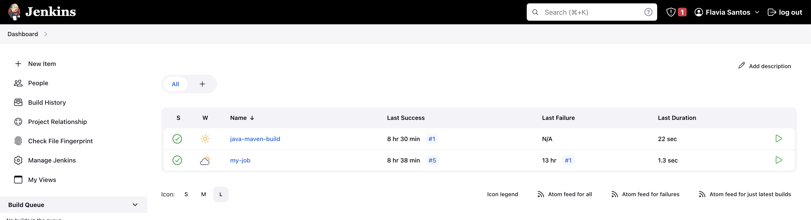

>> **Note**
> 
> If running the steps above don´t make Docker available in the Jenkins container, this [fix here](https://stackoverflow.com/questions/73110198/jenkins-error-buildind-docker-lib-x86-64-linux-gnu-libc-so-6-version-glibc) can be a solution. 
> It installs Docker inside de Jenkins container, not on the server host.

Fixed permissions on docker.sock:  change privilege to read and write for all users with:

```bash
$ ls -l /var/run/docker.sock
$ exit 
$ docker exec -it -u0 158cca0f88ce bash
$ chmod 666 /var/run/docker.sock
```

As a test:

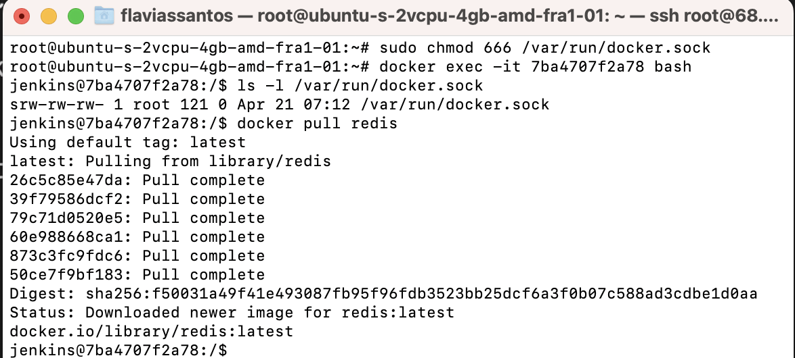

Configured Job to build Docker Image. Configure the java-maven-job removing the "Test" build step, add execute shell step and build the project:

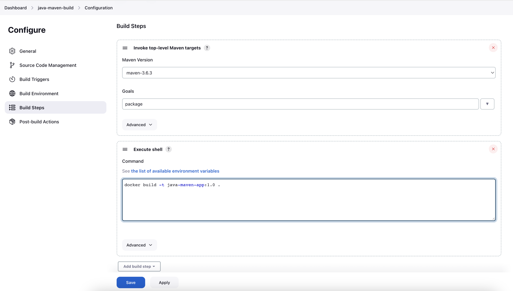

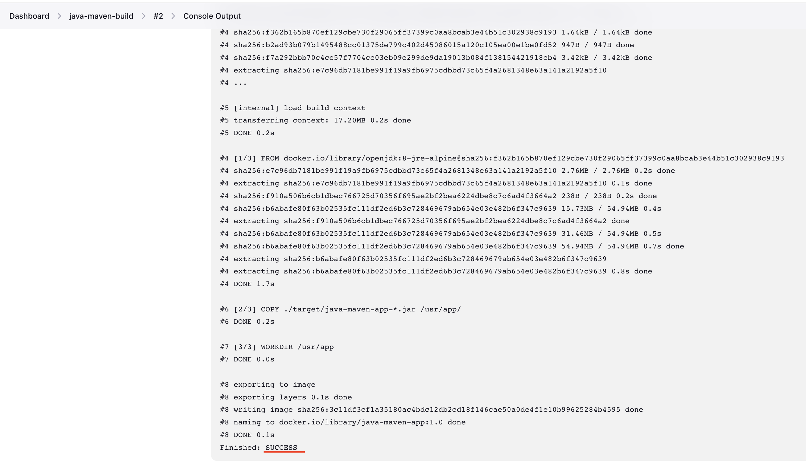

#### 2.3.1 Configured Job to push Image to DockerHub

Prerequisite: 

    - Account on DockerHub
    - Created a repository on DockerHub
    - Created Credentials for DockerHub in Jenkins UI:

 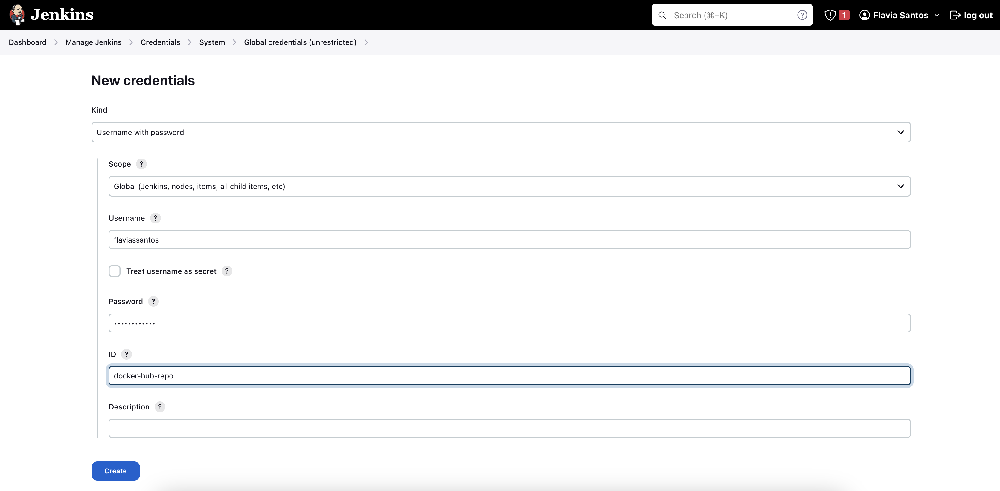

Add credentials/set global environment to Docker login inside the job:

 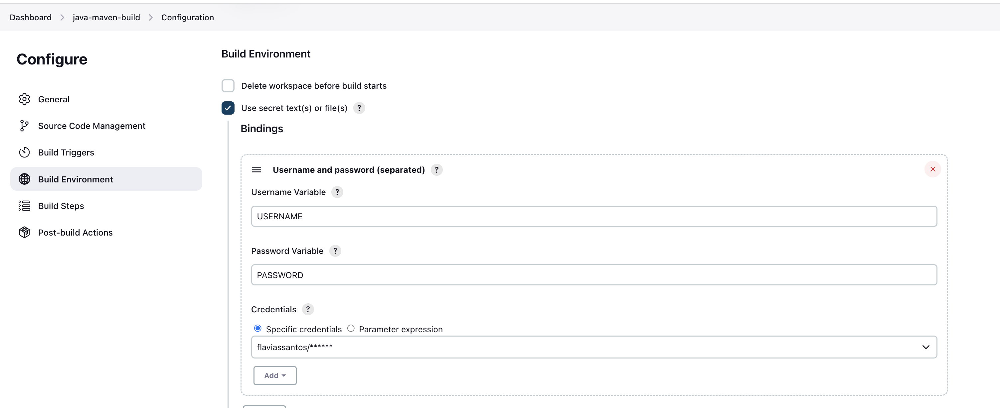

Tag Docker Image with your DockerHub repository, login and push to repository:

``` bash
docker build -t flaviassantos/my-repo:jma-1.0 .
docker login -u $USERNAME -p $PASSWORD
docker push flaviassantos/my-repo:jma-1.0
```
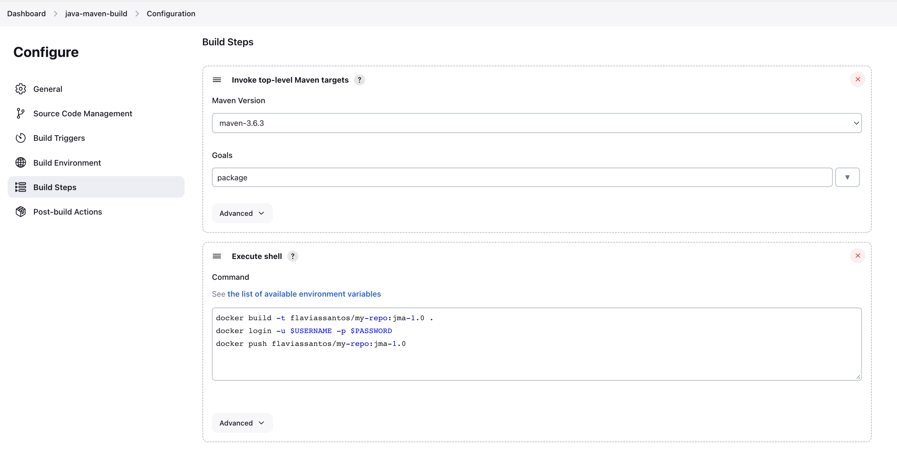

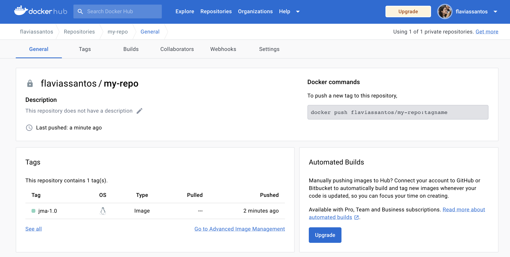

>>**Note**
> 
> Best practice is to provide the password as a standard input and not in the command line parameter:

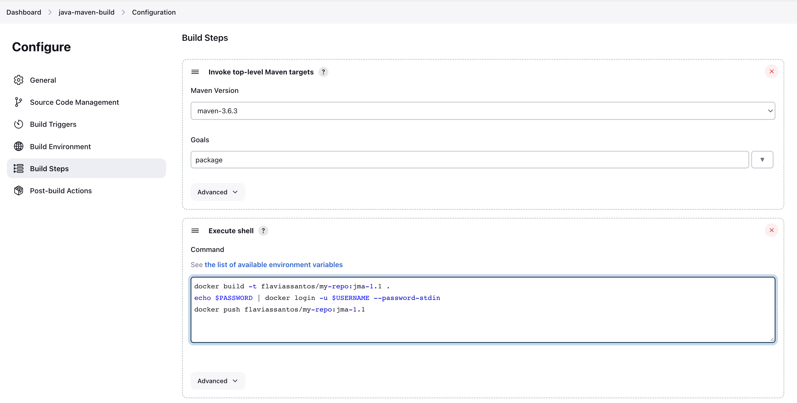

#### 2.3.2 Image to Nexus Repository

Configured “insecure-registries” on Droplet server (daemon.json file since the host server is a Linux machine)


``` bash
$ vim /etc/docker/daemon.json

{
  "insecure-registries" : ["[Nexus´s droplet IP]:8083"]
}

$ systemctl restart docker
```

Fixed permission for docker.sock again after restart of Jenkins container

```bash
$ ls -l /var/run/docker.sock
$ chmod 666 /var/run/docker.sock
```
Created Credentials for Nexus in Jenkins UI

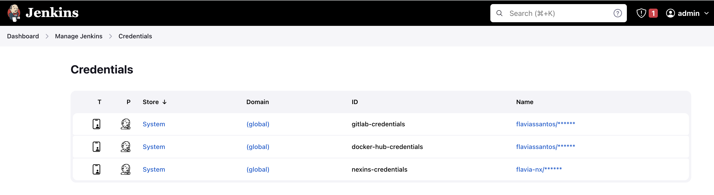

Tag Docker Image with our Nexus host and repository, login and push to
repository

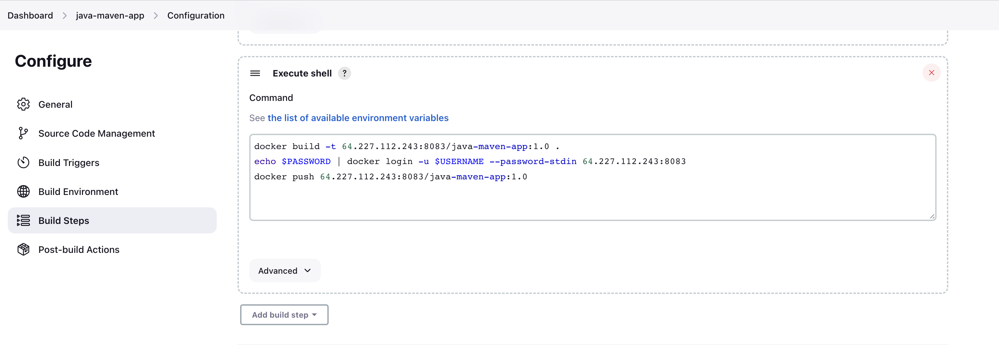

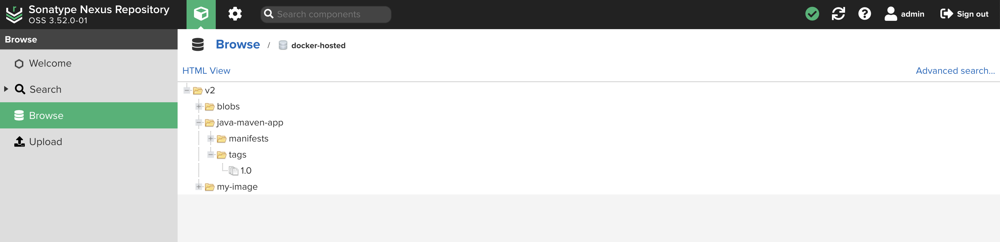


### 2.4 Create different Jenkins job types (Freestyle, Pipeline, Multibranch pipeline) for the Java Maven project with Jenkinsfile to:
#### a. Connect to the application’s git repository 

Configured Git Repository

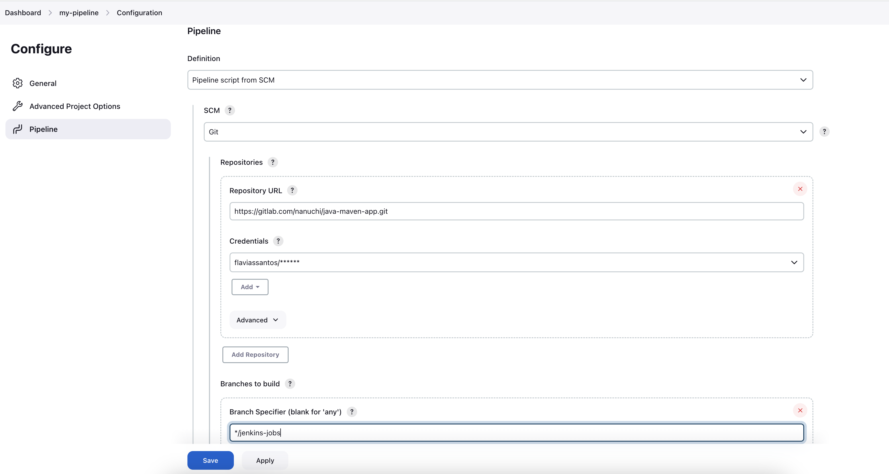

Created a valid Jenkinsfile with required fields. Some syntax examples:

- Used Post attribute: execute some logic AFTER all stages executed

  - Defined a Condition: to define the build status or build status change (always, success, failure, when)

❏ Used an environment variable

❏ Used Tools Attribute

❏ Used a Parameter

❏ Used an Input Parameter

❏ Used an external Groovy Script, example after build:

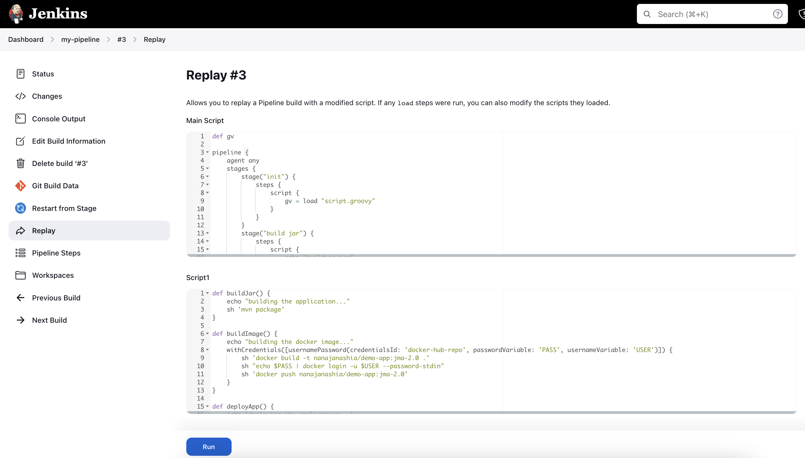

#### b. Basic Pipeline Job: build Jar, build Docker Image and push to private DockerHub repository

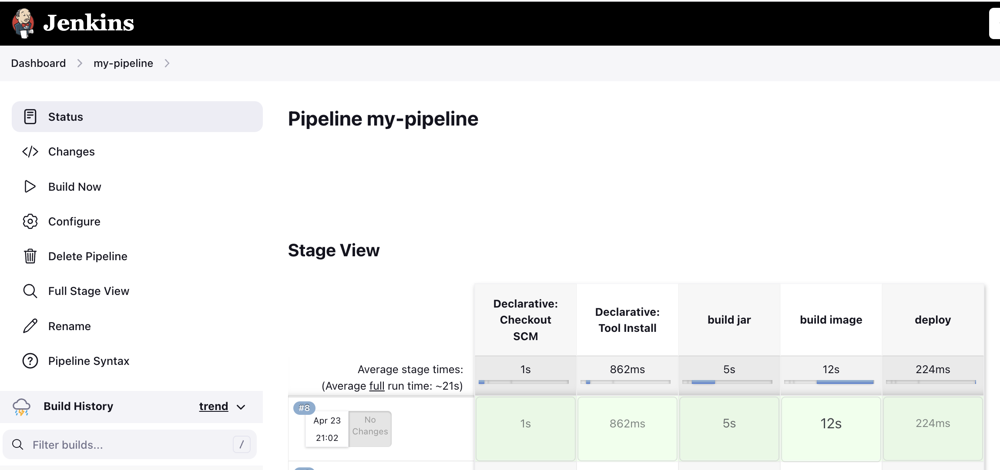

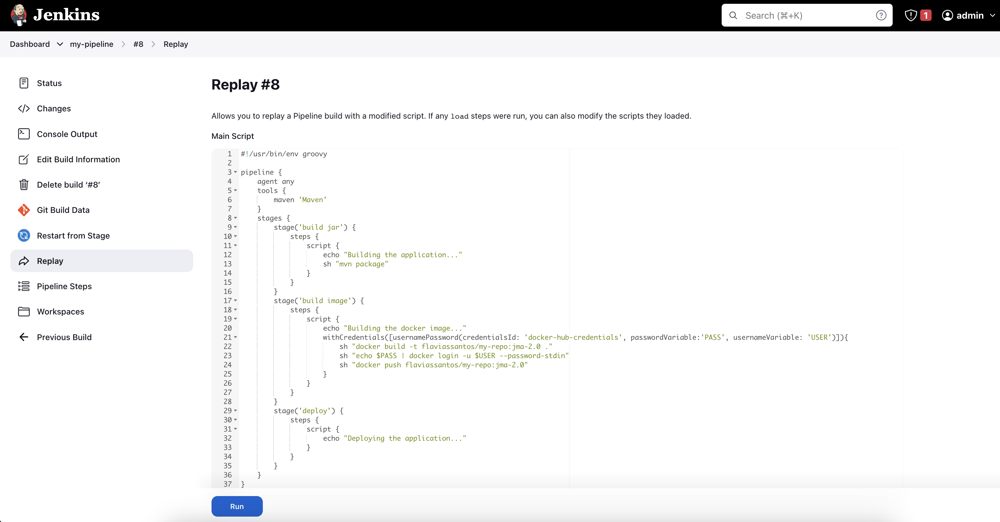

The Jenkinsfile above can be improved to:

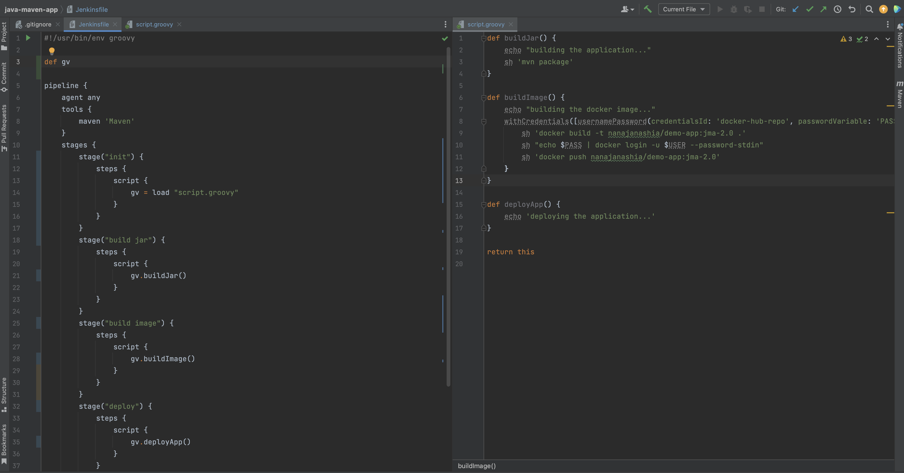

#### c. Multibranch pipeline: added branch based logic in Jenkinsfile

By adding a condition with BRANCH_NAME evnvironment variable in the Jenkinsfile of master and other branches:

``` groovy
#!/usr/bin/env groovy

pipeline {
    agent none
    stages {
        stage('test') {
            steps {
                script {
                    echo "Testing the application..."
                    echo "Executing pipeline for ${BRANCH_NAME}"
                }
            }
        }
        stage('build') {
            when {
                expression {
                    BRANCH_NAME == 'master'
                }
            }
            steps {
                script {
                    echo "Building the application..."
                }
            }
        }
        stage('deploy') {
            when {
                expression {
                    BRANCH_NAME == 'master'
                }
            }
            steps {
                script {
                    echo "Deploying the application..."
                }
            }
        }
    }
}
```

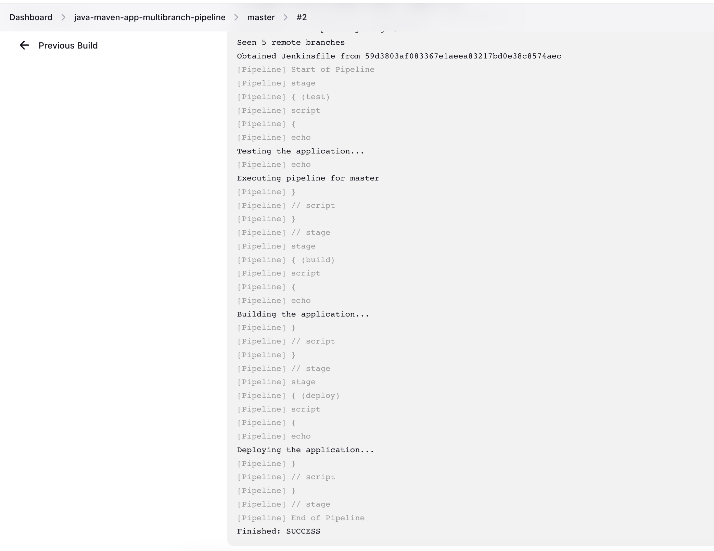

## 3. Create a Jenkins Shared Library

Jenkins Shared Library is a feature of Jenkins that allows you to write and reuse code across multiple Jenkins pipelines. In other words, it's a collection of code that can be used in various Jenkins jobs and projects. This code can be used to perform common tasks, such as building, testing, and deploying applications.

Shared libraries are important because they help standardize the way that code is written and executed across different Jenkins pipelines. This can improve code quality, reduce the amount of time spent on repetitive tasks, and make it easier to maintain and update pipelines.

#### Technologies used:
Jenkins, Groovy, Docker, Git, Java, Maven

### 3.1 Create a Jenkins Shared Library to extract common build logic:

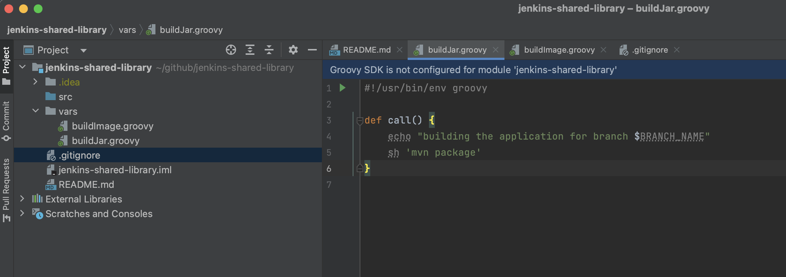

### 3.2 Create separate Git repository for Jenkins Shared Library project

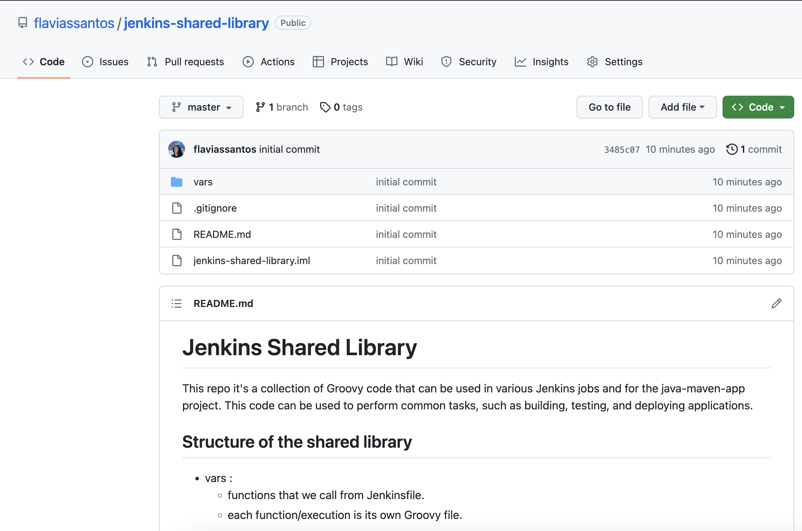

### 3.2 Create functions in the JSL to use in the Jenkins pipeline Integrate and use the JSL in Jenkins Pipeline (globally and for a specific project in Jenkinsfile)

❏ Used Parameters in Shared Library

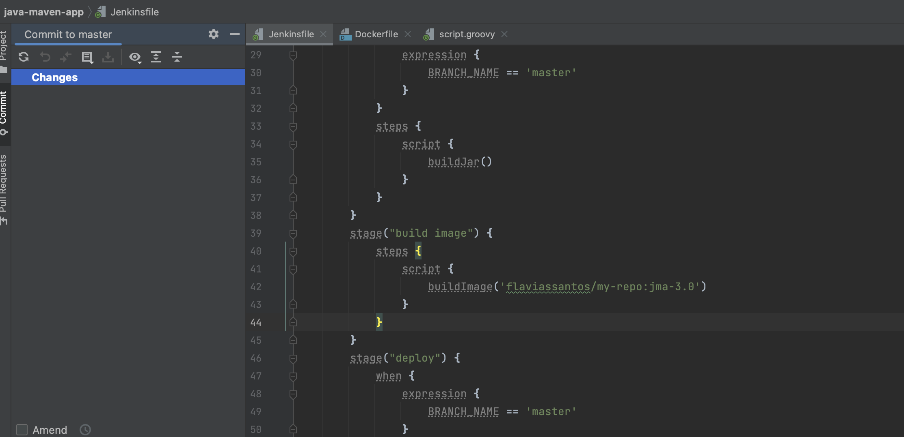

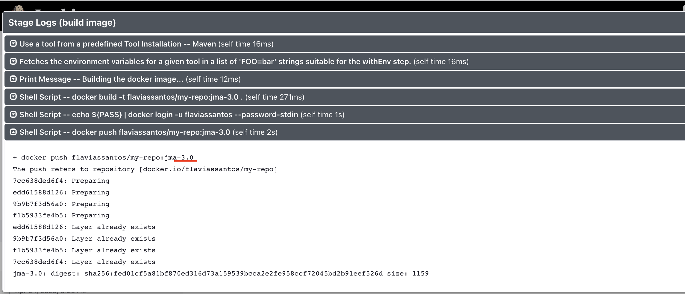

❏ Extracted logic into Groovy Classes

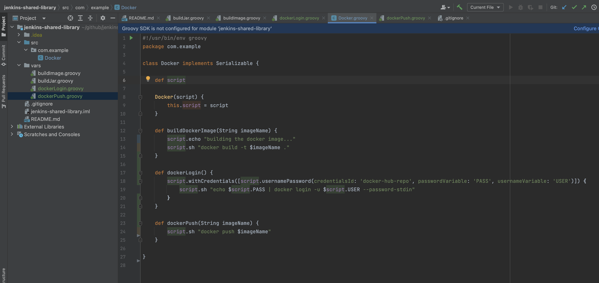

❏ Define Shared Library in Jenkinsfile directly (project scoped)

First, remove the global library from Jenkins UI and fix the Jenkinsfile:

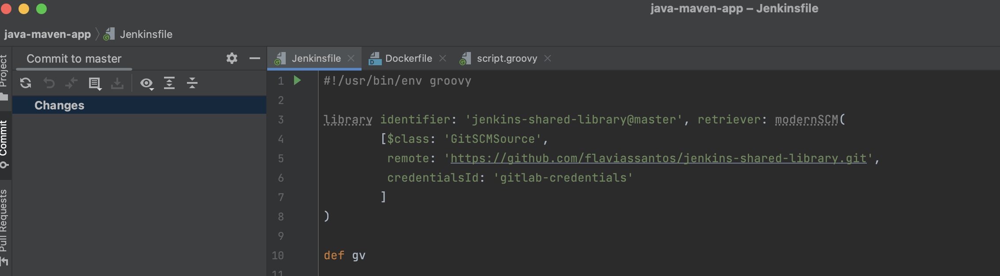

## 4. Configure Webhook to trigger CI Pipeline automatically on every change

#### Technologies used:
Jenkins, GitLab, Git, Docker, Java, Maven

#### Project Description:

- Install GitLab Plugin in Jenkins
- Configure GitLab access token and connection to Jenkins in GitHub project settings
- Configure Jenkins to trigger the CI pipeline, whenever a change is pushed to GitHub

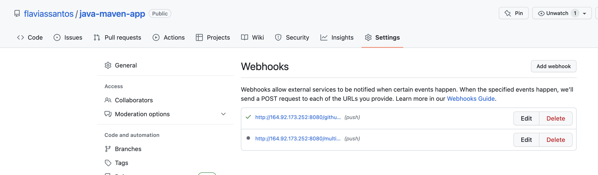

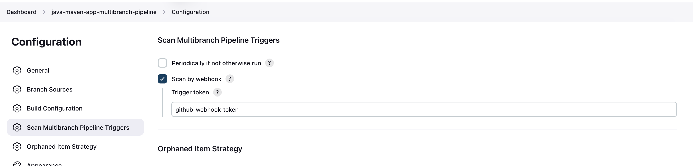


## 5. Dynamically Increment Application version in Jenkins Pipeline

#### Technologies used:
Jenkins, Docker, GitLab, Git, Java, Maven

#### Project Description:

### 5.1 Configure CI step

- Increment version locally with maven build tool
``` bash
$ mvn build-helper:parse-version versions:set -DnewVersion=\${parsedVersion.majorVersion}.\${parsedVersion.minorVersion}.\${parsedVersion.nextIncrementalVersion} versions:commit
```

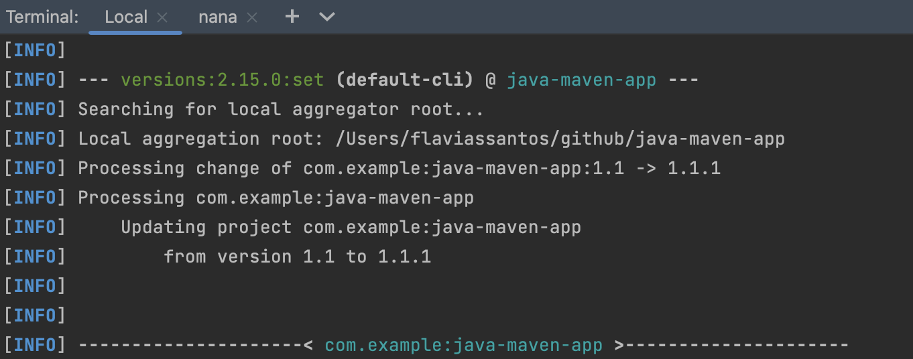

- Increment version in Jenkins Pipeline
  - Configured Jenkinsfile to increment version (steps "increment version" and "build image")
      ``` groovy
      #!/usr/bin/env groovy
      
      library identifier: 'jenkins-shared-library@master', retriever: modernSCM(
              [$class: 'GitSCMSource',
               remote: 'https://github.com/flaviassantos/jenkins-shared-library.git',
               credentialsId: 'gitlab-credentials'
              ]
      )
      
      def gv
      
      pipeline {
          agent any
          tools {
              maven 'Maven'
          }
          stages {
              stage("init") {
                  steps {
                      script {
                          gv = load "script.groovy"
                      }
                  }
              }
              stage('test') {
                  steps {
                      script {
                          echo "Testing the application..."
                          echo "Executing pipeline for ${BRANCH_NAME}"
                      }
                  }
              }
              stage('increment version') {
                  steps {
                      script {
                          echo 'incrementing app version...'
                          sh 'mvn build-helper:parse-version versions:set \
                              -DnewVersion=\\\${parsedVersion.majorVersion}.\\\${parsedVersion.minorVersion}.\\\${parsedVersion.nextIncrementalVersion} \
                              versions:commit'
                          def matcher = readFile('pom.xml') =~ '<version>(.+)</version>'
                          def version = matcher[0][1]
                          env.IMAGE_NAME = "$version-$BUILD_NUMBER"
                      }
                  }
              }
              stage("build jar") {
                  when {
                      expression {
                          BRANCH_NAME == 'master' | BRANCH_NAME == 'feature/increment-version'
                      }
                  }
                  steps {
                      script {
                          buildJar()
                      }
                  }
              }
              stage("build image") {
                  steps {
                      script {
                          buildImage("flaviassantos/my-repo:${IMAGE_NAME}")
                          dockerLogin()
                          dockerPush("flaviassantos/my-repo:${IMAGE_NAME}")
                      }
                  }
              }
              stage("deploy") {
                  when {
                      expression {
                          BRANCH_NAME == 'master'
                      }
                  }
                  steps {
                      script {
                          gv.deployApp()
                      }
                  }
              }
          }
      }
      ```
      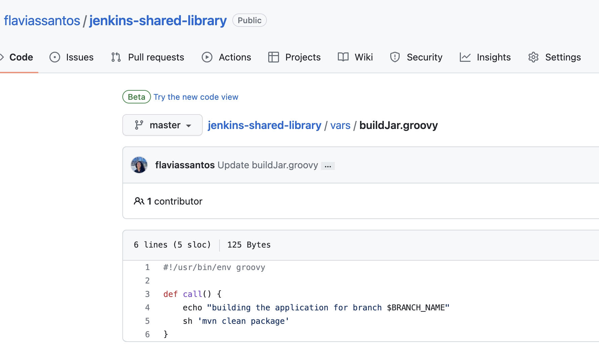
  - 
  - Adjusted Dockerfile file

    ```Dockerfile
    FROM openjdk:8-jre-alpine
    
    EXPOSE 8080
    
    COPY ./target/java-maven-app-*.jar /usr/app/
    WORKDIR /usr/app
    
    CMD java -jar java-maven-app-*.jar
    ```
  - Executed Jenkins Pipeline

  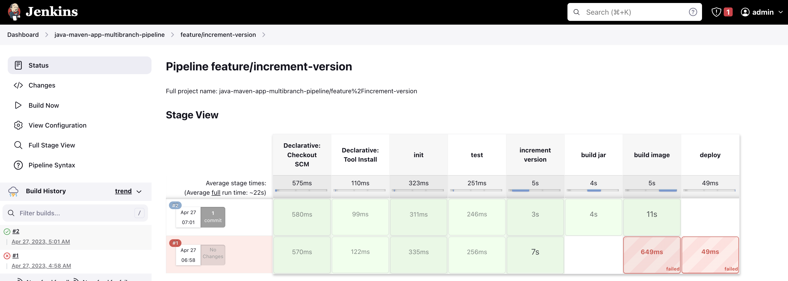
  
  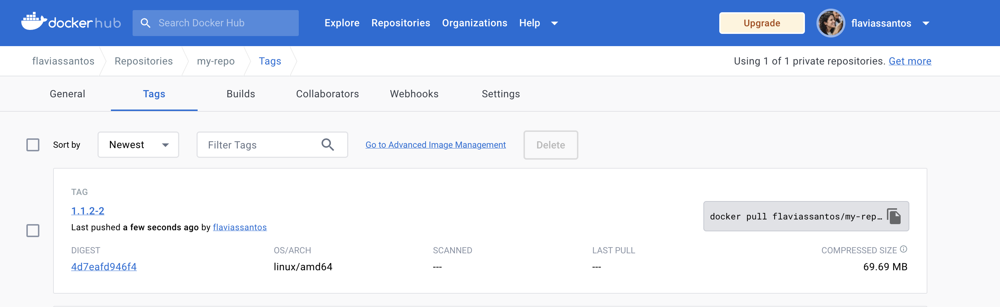

### 5.2 Configure CI step: Commit version update of Jenkins back to Git repository

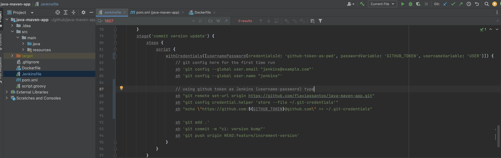

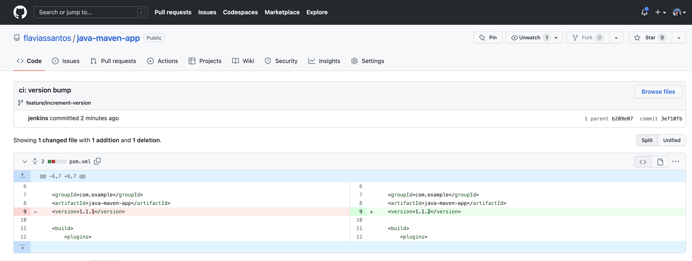

### 5.3 Configure Jenkins pipeline to not trigger automatically on CI build commit to avoid commit loop

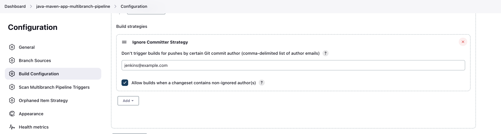