# Build Automation & CI/CD with Jenkins

## 1. Install Jenkins on DigitalOcean

#### Technologies used:

Jenkins, Docker, DigitalOcean, Linux

### 1.1 Created a Server dedicated to Jenkins on DigitalOcean
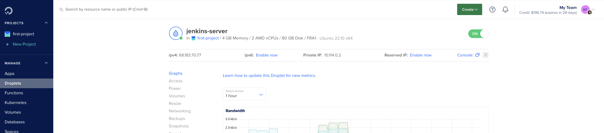

### 1.2 Configured Firewall Rules to open port 22 and port 8080 for our new Jenkins server

> **Note**
> 
> When adding SSH inbound firewall rule - security best practices is to have only 
the IP addresses that should have access to the server listed under the “Sources”.

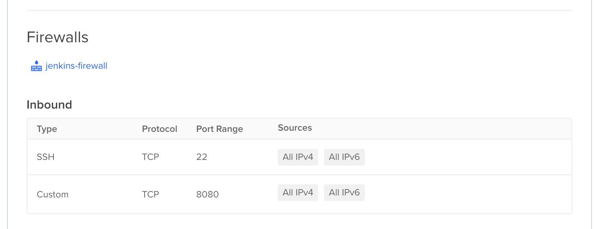

### 1.3 Installed Docker on DigitalOcean Droplet

``` bash
$ ssh root@[server IP]
$ apt update
$ apt install docker.io 
```

### 1.4 Started Jenkins Docker container with named volume

``` bash
$ docker run -p 8080:8080 -p 50000:50000 -d \
    -v jenkins_home:/var/jenkins_home jenkins/jenkins:lts
```

Port 50000 in the docker command is where the jenkins master and worker nodes  
communicates. Jenkins can be built and started as a cluster, if you have a 
large workload that you are running with jenkins.

The attached volume is to persist and back up data that the application needs:
so we can install plugins, configure jenkins, create users, create jobs to run 
workloads, and so on.

We can check the admin password given by Jenkins in the container´s volume:

``` bash
$ docker exec -it [container id] bash
$ cat /var/jenkins_home/secrets/initialAdminPassword
```
or find the volume on the server host and look at the password: 
``` bash 
$ docker volume inspect jenkins_home
```
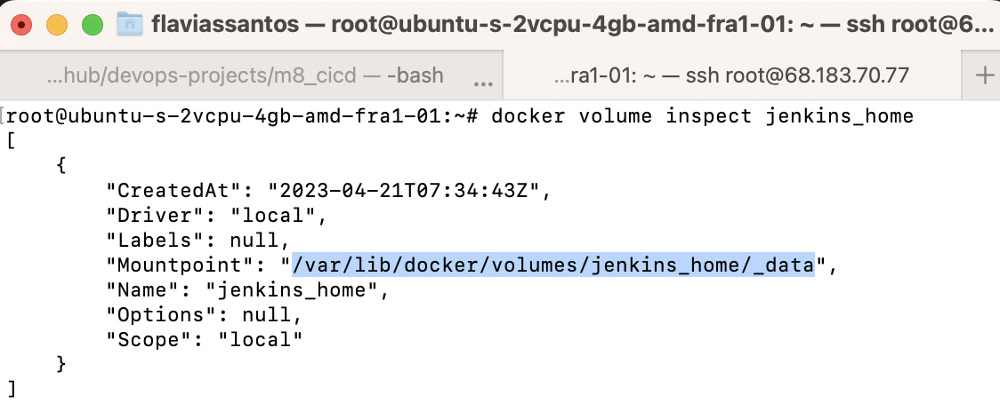

### 1.5 Initialized Jenkins

After inserting the admin password given, select the option to install 
recommended plugins and add an admin user.

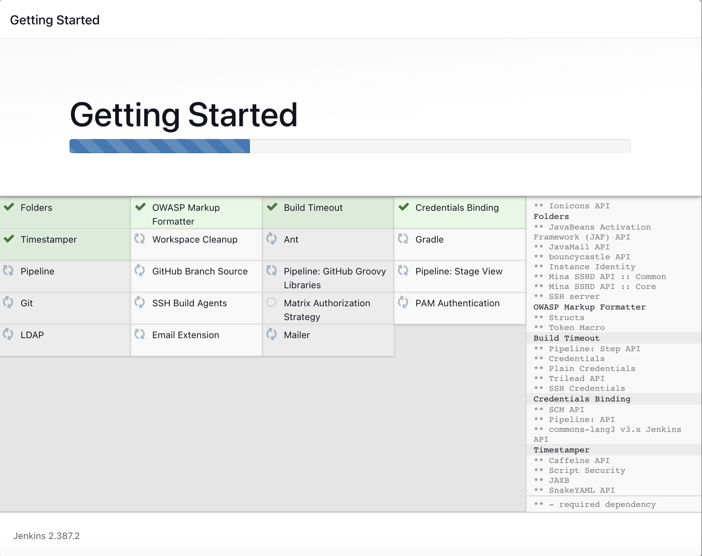

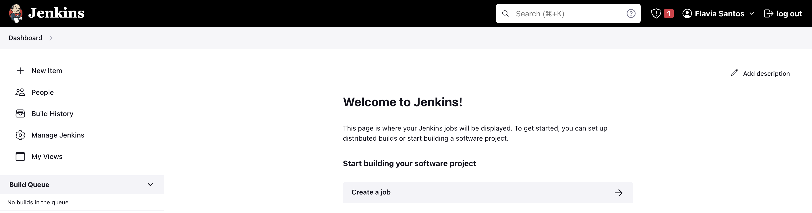


## 2. Create a CI Pipeline with Jenkinsfile (Freestyle, Pipeline, Multibranch Pipeline)

#### Technologies used:
Jenkins, Docker, Linux, Git, Java, Maven

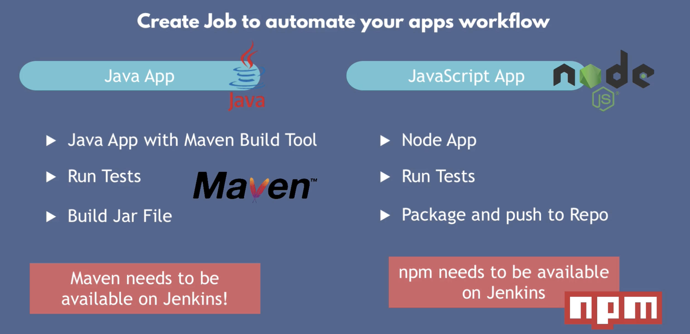


### 2.1 Install Build Tools (Maven, Node) in Jenkins

Configured Plugin for Maven under "Manage Jenkins>Global Tool Configuration":

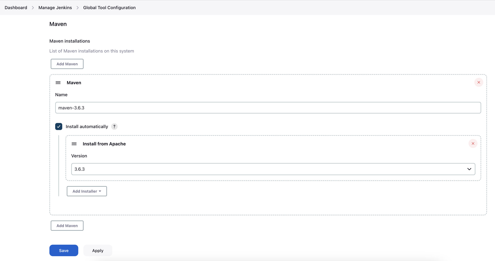

Installed npm and node in Jenkins container as a root user (using the flag "-u 0"):

``` bash
# enter container as root
$ docker exec -u 0 -it [jenkins container id] bash

# check with Linux distro container is running
$ cat /etc/issue
``` 
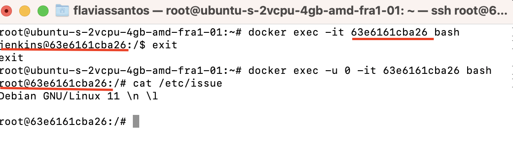
``` bash
$ apt update
$ apt install curl
$ curl -sL https://deb.nodesource.com/setup_10.x -o nodesource_setup.sh

# do ´$ ls´ to see the node script to be run:
$ bash nodesource_setup.sh
$ apt install nodejs npm -y
$ nodejs -v
$ npm -v
```

### 2.2 Create Jenkins credentials for a git repository

Create and build a freestyle job from "New Item" menu:
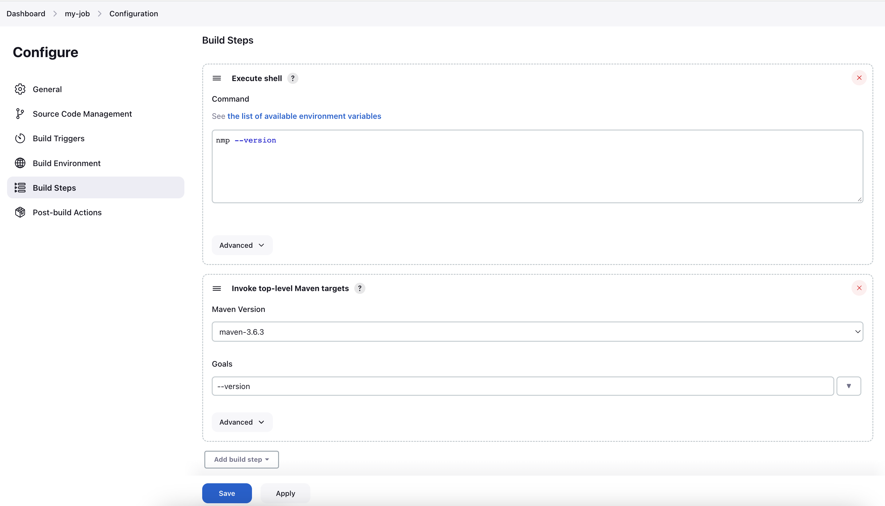

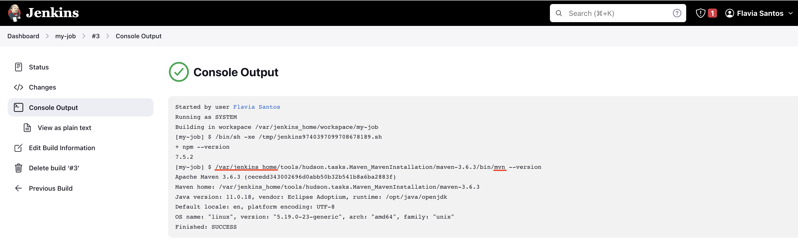


Configured Git Repository to checkout the code from:

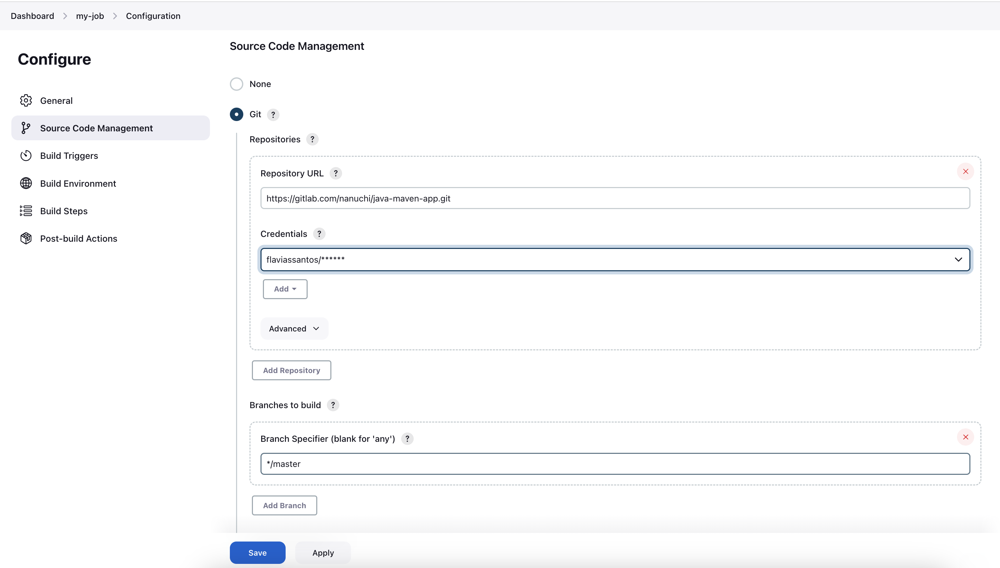

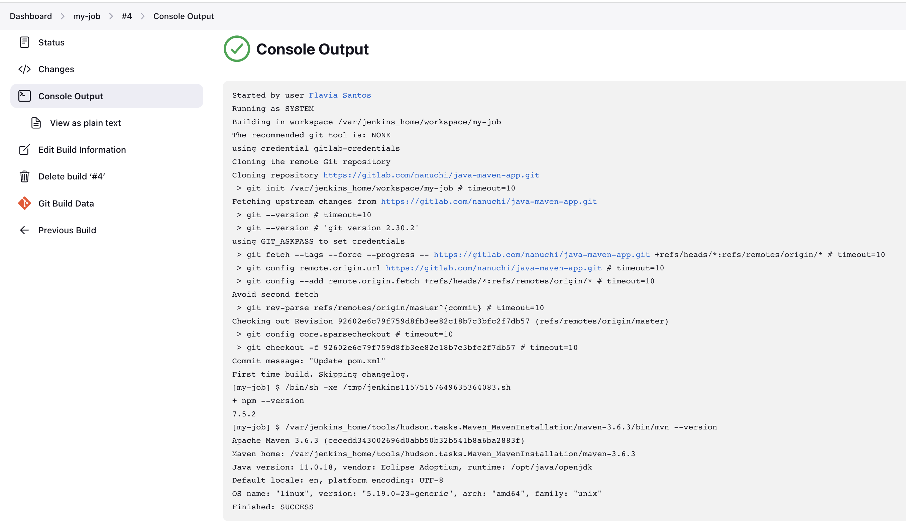

The data from the job is saved in the following volume inside the Jenkins container: 
```bash
$ ls /var/jenkins_home/jobs/[job name]
```
And the data from the git repository is saved on the volume:
```bash
$ ls /var/jenkins_home/workspace/[job name]
```

We can test out running a simple shell script from a file in the repository,
it is available in the branch "jenkins-jobs". Then we change the command to add execute 
permissiion to the Jenkins user to run that file:

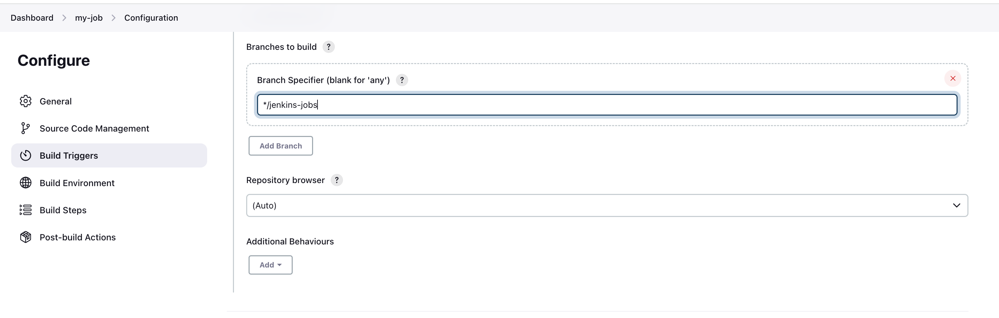

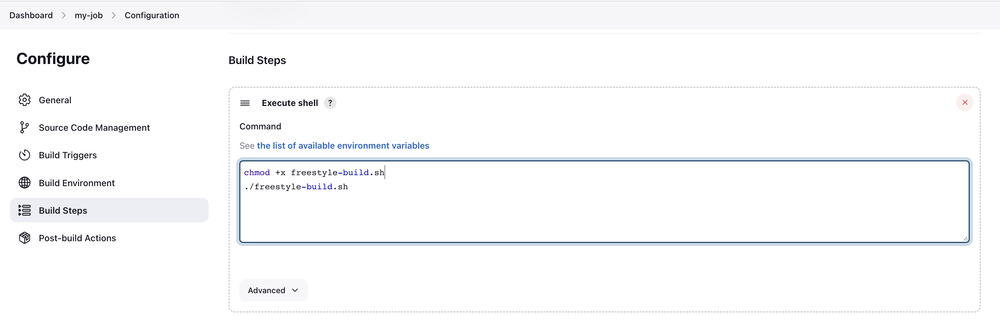

Configured Job to run tests and build Java Application. We created a new freestlyle job:

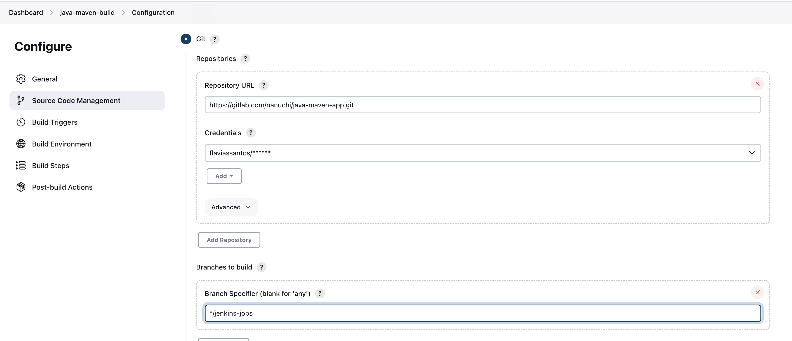

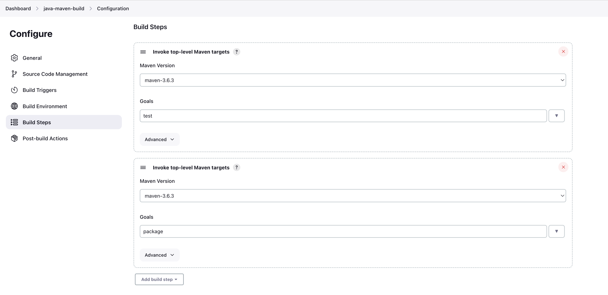

you can then see the jar file:

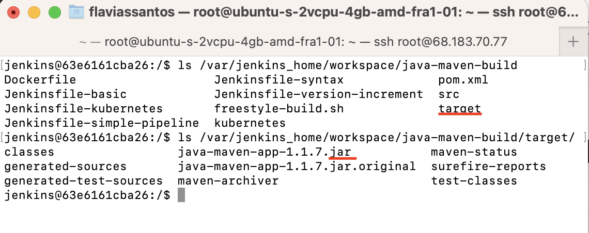

### 2.2 Make Docker available on Jenkins server


### 2.4 Create different Jenkins job types (Freestyle, Pipeline, Multibranch pipeline) for the Java Maven project with Jenkinsfile to:
#### a. Connect to the application’s git repository 
#### b. Build Jar

#### c. Build Docker Image
#### d Push to private DockerHub repository
